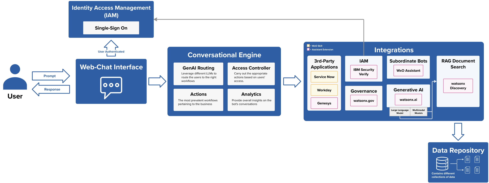

The goal of a solution doc is to outline a clear and actionable plan for implementing a unified agent that effectively 
leverages generative AI to route conversations to the appropriate actions and integrations. This document serves as a blueprint for developers
and project managers by providing a detailed roadmap for the overall implementation and configuration of various generative AI capabilities and third-party integrations,
as well as outlining the necessary infrastructure and workflows. 

This solution doc will address the different use cases for this soltuion, as well as outline the necessary requirements for building out each solution component to ultimately 
demonstrate a successful implementation of the unified agent with generative AI capabilities.

### Business Statement
- A plethora of siloed internal chatbots is posing challenges to an enterprise's operational, compliance, and enterprise architecture standards.
- Employees are frustrated because they have to locate the right chatbot to answer their specific questions.
- Enterprise Architecture team is frustrated because lines of business will launch their own chatbot to fill their teams’ specific needs.
- Compliance teams are frustrated because there is no single point of oversight to ensures that chatbot responses are grounded on vetted information and that sensitive material remains protected. ​

### Challenges
- **User Experience challenges:**
    - **Time to information:** Information is difficult to find in a timely manner, as employees need to first know which chatbot to leverage for their particular question.
    - **Limited Access:** users will only be able to leverage the chatbots they are aware of. Many employees will be without the conversational search of a chatbot unless they have awareness and access to it.
    - **Limited capabilities and integration**: very few chatbots are currently designed to do more than provide information. Employees need to take extra steps in order to action on the insight (like opening tickets, connecting with support, etc)
- **Cost and Operational challenges:**
    - **Redundant efforts:** lines of business across the business are duplicating efforts by creating redundant chatbots.
    - **Scalability:** Without a unified approach, every new chatbot that is added only magnifies the existing user experience challenges and info risk challenges.
- **Information Challenges:**
    - **Veracity Risk:** How can Enterprise Architecture and Compliance teams ensure that the many chatbots across each line of business are providing employees information grounded on vetted source material?
    - **Security and Sensitivity Risk:** How can Enterprise Architecture and Compliance teams ensure that sensitive material remains protected across specified clearance levels?
- **Enterprise-level governance:** Enterprise Architecture lacks a single view of all LLMs deployed in the organization.

### Desired Outcomes
- A platform that can unite across lines of business
- Flexibility to connect with existing systems as well as extend to future additions.
- Enable users to take actions (like opening tickets, changing passwords, etc)
- Enable users to answer questions, grounded on pre-approved source material
- Governed access to sensitive content (only allow access to content that you are cleared for)
- Delegate specified questions to vetted chatbots that may already exist across the enterprise

### Expected Benefits to the business
- A More Informed Workforce: less noise per inquiry, less time to answers
- Cost and Operational Efficiency Gains: reduced duplicated efforts and a scalable framework
- Enhanced Compliance and Governance: a united framework enables clearer centralized oversight - including models deployed, model health, source information, governed access to sensitive material

## Solution Components
The objective of this solution is to demonstrate a chatbot which has the ability to orchestrate conversations to the
appropriate channels and/or 3rd-party applications while leveraging generative AI technologies. This unified agent solution revolves around six key capabilities:

**Core Products:** watsonx Orchestrate, IBM Cloud Object Storage
| Capability    | IBM Product |
| -------- | ------- |
| Identity Access Management  |  IBM Security Verify   |
| Generative AI-Driven Conversational Routing |  watsonx.gov or watsonx.ai   Watson Matchine Learning   |
| RAG Document Search    | 
watsonx Discovery  watsonx.ai   Watson Machine Learning
 |
| 3rd-Party Application Integrations    | watsonx Orchestrate |
| Governance   | watsonx.gov |
| Subordinate Bot Integration   | watsonx Orchestrate Assistant |

---

----
### **Web-Chat Interface**
* Leveraging IBM Cloud Object Storage to host a static website for the chatbot.
    * Configuration Steps [here](/Create/Webchat%20Interface/Static-Webpage)

----
### **Identity and Access Management (IAM)**

Security can be demostrated in one of two ways:

1. **Security Verify SSO**
    * Configuration Steps [here](/Create/Identity%20and%20Access%20Management/IBM_Security_Verify)

2. **Simulation:**   
    * Leverage stored user information (e.g. username, password, role, access, etc,) in a data structure within the Assistant Builder.
    * Configuration Steps [here](/Create/Identity%20and%20Access%20Management/Simulated)
----
### **Conversational Engine**
* Built within the watsonx Orchestrate Assistant Builder
* Built out Generative AI layer to route conversations to the right actions based on the logged-in user's access/role.
    * GenAI Routing: Configuration Steps [here](/Create/GenAI_routing_create)
----
### **Integrations**
#### **RAG Document Search**
* Leverage native assistant builder extensions to integrate with watsonx Discovery or watson Discovery
    * watsonx Discovery Configuration Steps [here](/Create/RAG%20Document%20Search/Watsonx_Discovery)
    * watson Discovery Configuration Steps [here](/Create/RAG%20Document%20Search/Watson_Discovery)

#### **Governance**
* Leverage native assistant builder extensions to integrate with watsonx.gov
* Configuration Steps [here](/Create/Governance/watsonx_gov)

#### **3rd-Party Applications**
* Leverage native assistant builder extensions to integrate with Genesys.
    * Genesys Configuration Steps [here](/Create/Third%20Party%20Apps/Genesys)
* Leverage watsonx Orchestrate skills to integrate with ServiceNow and Workday
    * ServiceNow Configuration Steps [here](/Create/Third%20Party%20Apps/ServiceNow)
    * Workday Configuration Steps [here](/Create/Third%20Party%20Apps/Workday)

#### **Subordinate Bot**
* Leverage native assistant builder extensions to integrate with other watsonx Assistants
* Configuration Steps [here](/Create/Subordinate%20Bots/assistant_custom_extension)
----
### **Data Repository**
* Leverage Cloud Object Storage to store documents relevant to the use case
