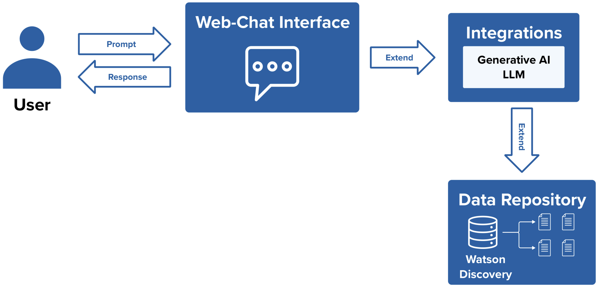
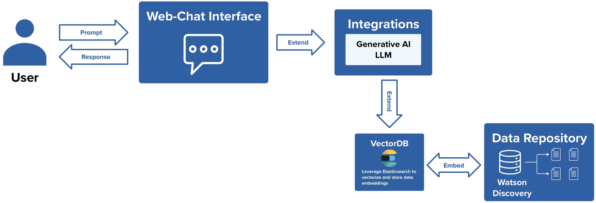

## Overview

By leveraging a RAG pipeline to help users query a given knowledge base corpus, the Assistant can provide a more reliable and accurate knowledge base search experience. 
This not only enhances the overall user experience but also ensures that users receive the most relevant and up-to-date information possible by providing source links to the provided answers.

A RAG pipeline for Document Search usually consists of a Data Repository, a Vector Database and a Large Language Model. This pipeline can be carried out as one of three patterns.

## Solution Implementation

### **Method 1: watson Discovery**

This pattern consists of creating two integrations with Watson Discovery and watsonx.ai. Watson Discovery is used to store and carry out searches on data collections.

**Required Integrations:**
* watson Discovery
* watsonx.ai

[Implementation Guide Here](/Create/RAG%20Document%20Search/Watson_Discovery)
### **Method 2: watsonx Discovery with Elasticsearch**

This pattern consists of creating an integration with watsonx Discovery. watsonx Discovery is used to store and carry out searches on data collections.
**Required Integrations:**
* watsonx Discovery
* watsonx.ai

[Implementation Guide Here](/Create/RAG%20Document%20Search/Watsonx_Discovery)
