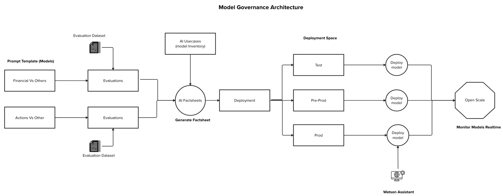

## Overview

Implementing watsonx governance mechanisms for AI activities is essential to effectively manage the complexities and risks inherent in AI Model deployments.

By establishing clear guidelines, processes, and oversight mechanisms, can help in mitigate risks such as data bias, model drift, and can continously monitor models on real time.

Moreover, governance fosters transparency and accountability by documenting the AI model development process, data sources, and decision criteria. This transparency builds trust among stakeholders and also streamlines the process of building AI solutions.

Additionally, governance frameworks enable organizations to optimize resource allocation by prioritizing AI initiatives that deliver tangible business value. By providing oversight and guidance, governance ensures that resources are deployed efficiently and effectively.

Overall, governance is essential for organizations to responsibly harness the power of AI while mitigating risks and ensuring compliance. IBM® watsonx.governance™ offers a comprehensive framework for organizations to establish transparency, accountability, and compliance in their AI initiatives, enabling them to unlock the full potential of AI technologies while minimizing associated risks.

## Solution Implementation

### watsonx.gov

Utilizing IBM® watsonx.governance™ offers a streamlined solution for the development, evaluation, deployment, and monitoring of AI models, ensuring optimal performance and compliance throughout the model lifecycle.

The process begins with the AI Engineer writing prompts using the Prompt Lab interface, leveraging various models to achieve the desired outcomes. These prompts undergo continous evaluation using watsonx.gov's evaluation features, leveraging pre-created evaluation datasets to assess model performance and effectiveness. Iterative cycles of prompt refinement and evaluation continue until the desired outcomes and evaluation metrics are achieved.

Once a model meets the established evaluation metrics, it is seamlessly integrated into the model inventory within the governance framework. Here, the model's lifecycle is tracked, and its metadata is captured in AI Factsheets, providing comprehensive documentation and transparency.

Upon approval within the model inventory, the model progresses to deployment status (Test, Pre-prod & Prod). Depending on its designated status, the model is deployed into Watson Machine Learning (WML) deployment spaces, including test, pre-production, and production environments. This ensures a controlled and systematic rollout of AI models across operational stages.

Continuous monitoring is a key aspect of the solution, with deployed models being continuously monitored for incoming data and evaluated against predefined metrics such as model health and drift. Any deviations from established thresholds trigger automatic alerts, enabling proactive intervention and maintenance of model performance and integrity.

In summary, the implementation of IBM® watsonx.governance™ provides a comprehensive and seamless solution for the development, evaluation, deployment, and monitoring of AI models, ensuring compliance, transparency, and optimal performance throughout the AI lifecycle.

[Implementation Guide Here](/Create/Governance/watsonx_gov)

### RAG Source Links
For every user query that involves RAG Document Search, a source link will be provided with each response to ensure transparency by clearly indicating the data corpus from which the answer was derived.

[Implementation Guide Here](/Create/Governance/rag_sourcelinks)
